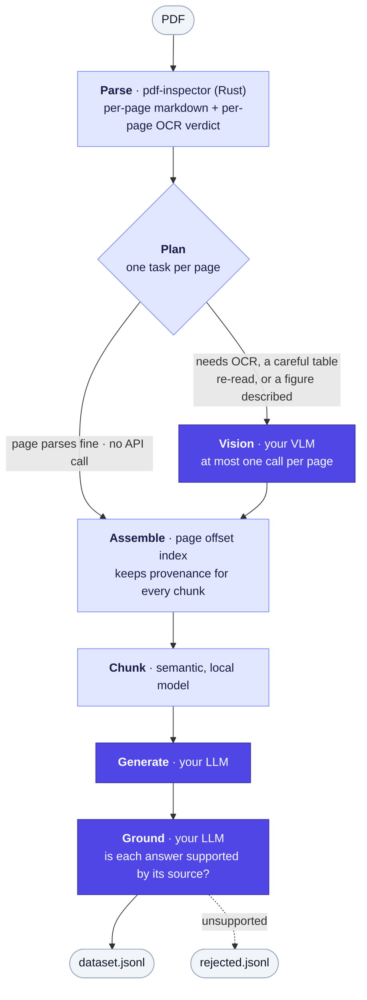
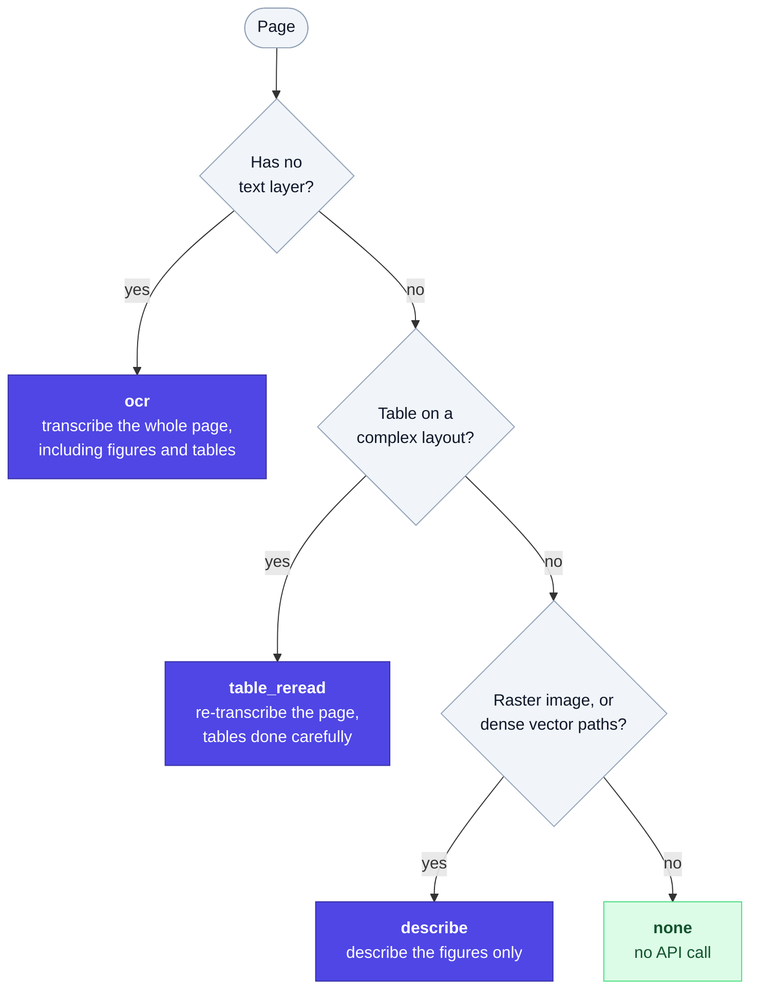

<p align="center">
  <picture>
    <source media="(prefers-color-scheme: dark)" srcset="assets/logo-dark.svg">
    
  </picture>
</p>

<p align="center">
  <strong>Turn a PDF into a finetuning-ready QA dataset, using your own OCR and LLM endpoints.</strong>
</p>

<p align="center">
  
  
  
</p>

---

You point pyqa at a document and an OpenAI-compatible inference server — vLLM,
TGI, Together, Groq, OpenRouter, Ollama, or OpenAI itself. It parses the PDF,
reads the parts only a vision model can read, chunks the result semantically,
generates question-answer pairs, discards the ones that aren't supported by the
source, and writes JSONL to your disk.

Built for anyone finetuning a small model on documents they already have: a
research corpus, product manuals, internal policy, case files, course notes.

**No pyqa-owned network calls, no credentials on the command line, no telemetry.**
Your documents go only to the endpoints you configure.

```bash
pyqa inspect  policy.pdf                        # what will this cost?  (free)
pyqa chunk    policy.pdf                        # how does it chunk?    (free)
pyqa run      policy.pdf -c pyqa.toml -o ./out  # build the dataset
```

## How it works



<p align="center"><sub>
  <b>Indigo</b> stages call your endpoints and cost money.
  <b>Pale</b> stages run locally and cost nothing.
</sub></p>

**Parsing is free and fast.** [`pdf-inspector`](https://github.com/firecrawl/pdf-inspector)
is a Rust library that returns per-page Markdown *and* a per-page verdict on
whether the page actually needs OCR. Most pages of most documents parse natively,
so they never reach a model at all.

**Vision is the only stage that sends page images anywhere**, and it makes at
most one call per page. A planner assigns each page exactly one task:



`ocr` subsumes the others, so a scanned page containing a chart is never billed
twice.

### Figures are found by shape, not just by image

Most PDF flowcharts are **drawn with vector path operators and contain no image
object at all**. Detection that only looks for embedded images misses exactly the
diagrams that matter most in policy and technical documents, so pyqa looks for
dense vector-path clusters too.

Repeated images are fingerprinted and suppressed — without that, a letterhead
logo would bill a vision call on every single page.

Descriptions are spliced back **at the figure's position**, so the figure travels
into the same chunk as the prose that introduces it:

````markdown
Applications are routed by score band as shown below.

```figure page=12
A five-stage flowchart: intake, scoring, review, decision, notification.
Applications scoring below 620 branch to manual review.
```
````

That description is now ordinary document text: it gets chunked, questioned, and
grounded like anything else.

### Grounding

Every generated answer is re-checked against the chunk it came from. Unsupported
pairs go to `rejected.jsonl` **with reasons**, so you can audit yield rather than
trust it. This is the difference between a dataset that teaches your model the
document and one that teaches it to hallucinate confidently.

## Install

```bash
uv sync
```

Python 3.12+. No system dependencies — PDF parsing and rendering ship as
prebuilt wheels.

## Configure

Copy `pyqa.example.toml` and edit it. Credentials come from the environment:

```toml
[generate.endpoint]
model    = "Qwen/Qwen2.5-14B-Instruct"
base_url = "http://localhost:8000/v1"
api_key  = "${PYQA_API_KEY}"
```

`${VAR}` and `${VAR:-default}` are expanded at load time. A referenced variable
that isn't set is an error immediately, rather than a puzzling 401 an hour into a
long run.

Each stage takes its own endpoint, so you can point them at different models — a
vision model for pages, a strong model for generation, a cheap one for grounding.
Omit `[ground.endpoint]` to reuse the generation endpoint.

Confirm everything answers before starting:

```bash
pyqa check-connection -c pyqa.toml
```

## Output

`out/dataset.jsonl` — chat/messages format, ingested directly by TRL, Axolotl,
Unsloth, and OpenAI finetuning:

```json
{"messages":[{"role":"system","content":"..."},{"role":"user","content":"What is the maximum LTV for a second-lien HELOC?"},{"role":"assistant","content":"..."}]}
```

Alongside it:

| File | Contents |
|---|---|
| `dataset.jsonl` | Kept pairs, training-ready |
| `rejected.jsonl` | Dropped pairs with reasons and provenance |
| `manifest.json` | Page counts, vision calls by task, chunks, yield, timings, models |

Set `output.include_provenance = true` to carry chunk id and page span in the
training file too; it's off by default because most trainers choke on unexpected
keys.

## Controlling cost

`pyqa inspect` projects the exact number of vision calls **before** you spend
anything. It's also where you tune figure-detection thresholds against your own
documents:

```
policy.pdf
  128 pages · classified mixed (confidence 0.94) · layout complex

Page  Vision task  Figures  Tables  Cols  Chars  Why
   1  none               -    -      -      847
   2  describe           1    -      -      612  1 vector figure region(s)
   3  ocr                -    -      -        0  page has no extractable text layer
   4  table_reread       -    ✓      ✓      903  table on a complex layout

Projected vision calls
  ocr               1
  table_reread      1
  describe          1
  total             3 of 128 pages
```

Then adjust: `--no-figures`, `--no-table-reread`, `--no-ground`, or
`--max-vision-pages N` — which trims optional work but **never** drops OCR, since
dropping that would lose the page's text entirely.

Vision results are cached against the document hash, so an interrupted run
resumes without paying for OCR twice. Use `--no-cache` to force fresh calls.

## Use as a library

```python
import asyncio
from pyqa import Config, run_async

config = Config.load("pyqa.toml")
result = asyncio.run(run_async("policy.pdf", config, progress=print))

print(result.manifest["pairs"])       # {'generated': 412, 'kept': 389, ...}
print(result.chunks[0].page_label)    # 'p12-13'
```

Every engine is a `Protocol` you can replace without forking:

| Protocol | Default | Replace it to… |
|---|---|---|
| `Parser` | `pdf-inspector` | use a different PDF backend |
| `VisionEngine` | OpenAI-compatible VLM | call a bespoke OCR service |
| `Chunker` | chonkie `SemanticChunker` | chunk by your own rules |
| `ChatClient` | OpenAI-compatible | route through your own client |

Progress is a structured event stream, not print statements — pass any callable
taking a `ProgressEvent`.

## Notes

**Air-gapped environments.** Chunking uses a small local embedding model
(`minishlab/potion-base-32M`) downloaded once from HuggingFace. Pre-seed the HF
cache before going offline, or point `chunk.embedding_model` at a local path.

**Structured output.** OpenAI-compatible servers disagree about `response_format`.
pyqa negotiates once per run — `json_schema` → `json_object` → prompt-only — and
validates every response locally regardless of which path was taken. The mode it
settled on is recorded in the manifest.

**macOS + uv.** `uv` writes the editable-install `.pth` file with the macOS hidden
flag, and CPython deliberately skips hidden `.pth` files, so `import pyqa` breaks
silently after a sync. `make sync` handles it, or run it yourself:

```bash
chflags nohidden .venv/lib/python*/site-packages/*.pth
```

## Development

```bash
make test   # sync, then run the suite
make lint   # ruff check + format
```

The suite runs against a stub OpenAI-compatible server, so it needs no
credentials and no network. Regenerate assets and fixtures with:

```bash
make fixtures
uv run python assets/make_logo.py
```
